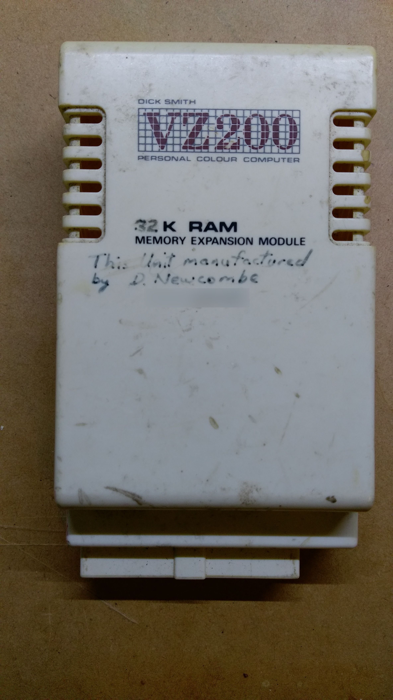
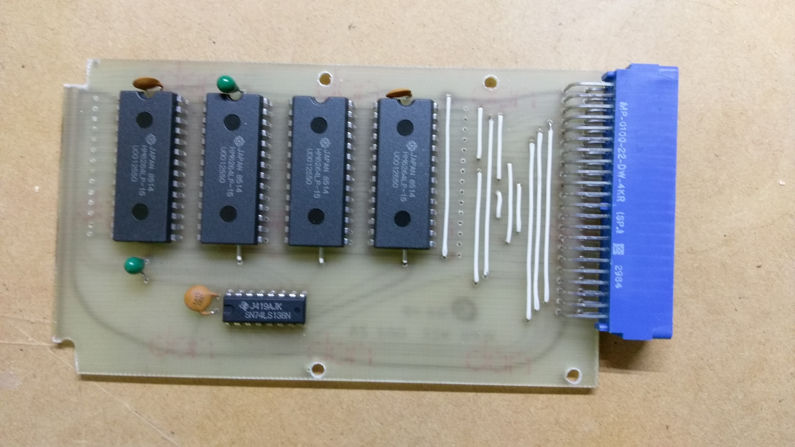
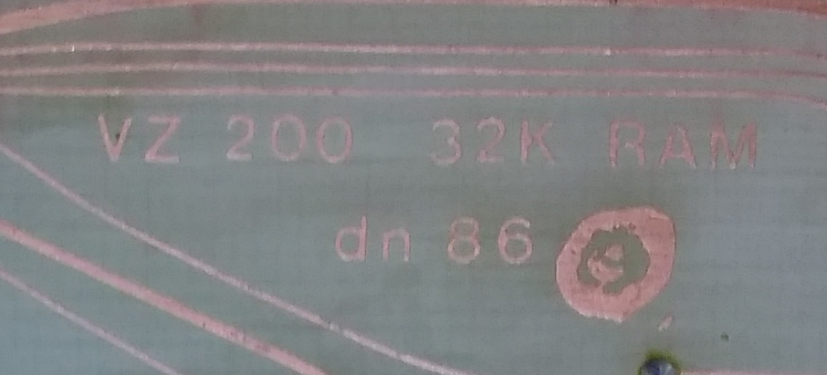
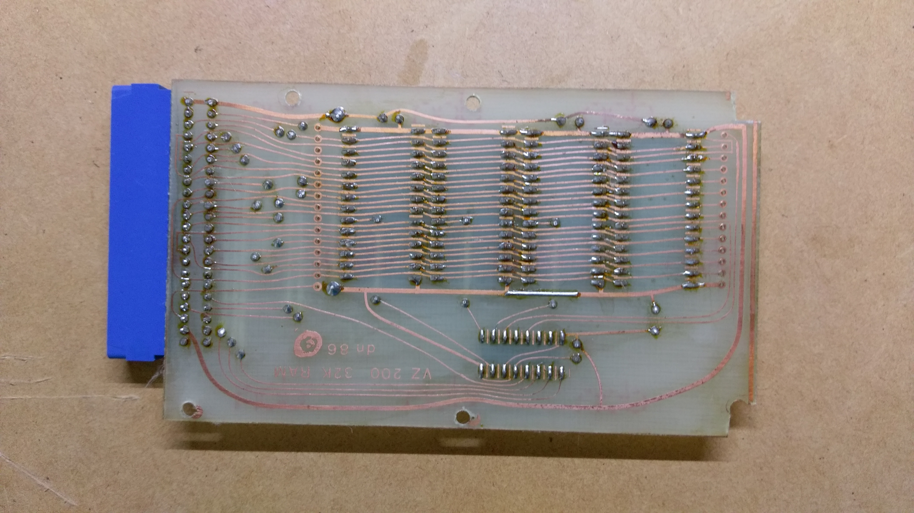

VZ200 32K Memory Expansion Module
=================================

This page describes the 32K Memory Expansion Module that was donated to me.

The case is obviously from a standard 16K Memory Expansion module,
[schematic here](schematics/VZ200_16K_RAM_Expansion/PDF/VZ200_16K_RAM_Expansion.pdf).
However, it is not standard!  The case clearly says "32K" and there is an
inscription in marker pen: "This Unit manufactured by D.Newcombe" and a
phone number.  I have blurred out the phone number:

Upon opening the case, I expected to see a normal 16K Memory Expansion
board with the 4116 DRAM's replaced with 4132 or 4164 DRAM's instead,
plus some bodge wires for the extra address lines.  Nope!  It was a
completely different design using four HM6264 8K x 8-bit static RAM
chips and a 74LS138 for address decoding:

The copper side of the board has "dn 86" written on it.  I guess that
means "D.Newcombe 1986".  I think the symbol to the right of "dn 86"
is supposed to be a hand-drawn &copy; symbol, but it doesn't look like it
in this picture:

I have traced the schematic and redrawn it in KiCad, which you can find
[here](schematics/D_Newcombe_32K_RAM_Expansion/PDF/D_Newcombe_32K_RAM_Expansion.pdf).

I cleaned up the case with Windex and water, and gave the PCB a clean
with isopropyl alcohol.  Works perfectly!

The standard 6K of program RAM on the VZ200 motherboard occupies addresses
$7800 to $8FFF.  The 32K expansion module occupies addresses $8000 to $FFFF.
There is some overlap in the address ranges.

However, this doesn't seem to affect the operation.  When the CPU writes to
addresses between $8000 and $8FFF, it writes to both the internal
program RAM and the expansion RAM.  As long as you don't try to read a
memory location before writing it, there should be no bus conflicts.
Both RAM chips should be driving the bus with the same data values when read.

This expansion RAM design should also work just fine with the Laser 200.
There won't be any address conflicts because the Laser 200 motherboard only
has 2K of program RAM and does not use addresses in the range $8000 to $8FFF.
