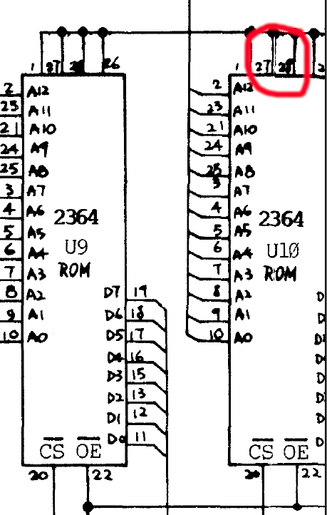

VZ200 Restoration
=================

This repository chronicles my exploits in restoring a Dick Smith VZ200
that I got off eBay.  The VZ200 is a rebadged VTech Laser 200, which was
sold in Australia from 1983 onwards.

The eBay seller Ben had this to say about the unit: "It was an op-shop
pickup from my Nan and had been in storage in a plastic container for who
knows how long.  As it did not have any leads I never tested it."

## Technical specifications

* Z80A 8-bit CPU, running at 3.58MHz.
* 16K of ROM containing BASIC.
* 2K of video RAM for either 32 x 16 text mode or 128 x 64 graphics mode.
* 6K of user program RAM, expandable to 22K using a 16K RAM expansion module.
* 45 key chiclet keyboard organized in a 6x8 matrix.
* Motorola 6847 video processor.
* RF and composite video output.

Note: The VZ300 is essentially the same computer except that it has 16K of
user program RAM on-board and a mechanical keyboard.

Outside of Australia and New Zealand, the VZ200 and VZ300 were known as the
Laser 200 and Laser 310 respectively.

## Restoration

Note: All images below have been scaled down.  Use "Open Image in New Tab"
or equivalent in your Web browser for a full-sized image.

### Initial condition of the unit

There were no power or video cables with the unit that was shipped to me.
The unit had not been powered on for a long time.  The power input is 9V DC
with a standard DC barrel jack, so power can be easily supplied with a
modern plugpack / wall wart.

The outside of the case was dirty, but nothing that some water, Windex,
paper towels, and elbow grease wouldn't fix.  The plastic was a little
yellowed but not too bad.

Serial number 075172.

The covers for the memory expansion and peripheral ports were still in place,
so I was hopeful that it had never been opened.

However, once inside I discovered some dirt and the braids connecting the
RF shield to ground had been cut:

It looks like someone had tried to remove the RF shield before and had
not succeeded.  The shield is soldered down to the motherboard, but some
of the legs were loose indicating partial success.

### Checking rail-to-rail resistance

I measured the resistance between 5V and ground - 284 ohms.  The same
between 9V and ground.  Probably OK.  Not a dead short anyway.

The resistance between 5V and 9V was 34 ohms, due to an actual 32 ohm
resistor between the two:

### Removing the keyboard

I had to remove the keyboard from the top half of the case to clean the
case properly.  It looks like the original keyboard was in a module that
was pushed in from the top and then snapped into place.  Removing the
screws was easy, but I couldn't slide out the keyboard PCB without
cutting the snaps or the cross-piece.  I elected to cut the cross-piece:

The keyboard PCB has scratched-on letters indicating which key is which.
That's useful.

After that, it was easy to remove the rubber membrane for cleaning.
The key caps themselves are molded into the membrane, so there are no
individual keys to get lost.  The membrane was filthy:

### Removing the RF shield

The person who tried to remove the RF shield didn't do a very good job.
Solder had bridged tracks, and one of the tracks was ripped right off the PCB:

Using a solder sucker, solder wick, flux, heat, and some patience,
I managed to clean up the excess solder and get the shield off:

Here is the same photo with the major components marked up:

And here is a diagram that shows the location of all IC's, looking forward
from the front of the PCB (not to scale):

### Cleaning the case and keyboard membrane

I cleaned the top and bottom of the case and the keyboard membrane
with Windex and water.  Some stubborn stains on the back were cleaned
off with isopropyl alchohol.

### First power on test

I connected a current-limited bench power supply set to 9V and 1A and
gingerly turned it on.  The 7805 voltage regulator was putting out 4.925V
and the system was consuming 650mA from the 9V supply.  So it looks like
no dead shorts on the board.

No blue smoke escaped, and the power LED turned on, so that's good.

### Checking signals

I checked the signals coming out of the CPU.  The clock on pin 6
was sitting at 3.57797MHz - close enough to 3.58MHz.

The address lines and most data lines had reasonable looking activity,
but D1, D2, and D6 had weird-looking signals like this for D6:

The base line of the signal is shifted up by about 1.7V.  D1 and D2 were
also shifted to half-way between 0V and 5V.  So there was a conflict
on the data bus somewhere.

### Video test

Connecting up a Composite-to-HDMI video converter, I got garbage on
the screen.  Powering on and off multiple times gives different garbage
each time:

The video clock into the MC6847 was around 3MHz, the "HS" horizontal sync
signal out was around 13kHz, and the "FS" frame sync signal out was 50Hz.

The video clock should be 3.58MHz.  However, the schematic gates the
main 3.58MHz system clock to generate the video clock.  "CLK" is the
main system clock:

In some parts of the frame during the horizontal and vertical sync times,
the video clock is disabled.  I think my oscilloscope was getting confused
and showing the average clock rate which undercounts due to the gating.
The same applies to the horizontal sync signal which isn't active for the
entire frame.

The frame sync was bang on 50Hz, and the generated video looked reasonable,
so the MC6847 must be getting the right timing.

The pictures don't show it, but there was a lot of static on the screen
which may be due to the clock signals, the CPU struggling to write to
video RAM, or a noisy component in the video output circuitry.

### Replacing the ROM's

From information I gleaned online, a common cause of bus crashes on the
VZ200 are the 2364 mask ROM's U9 and U10.  In [this video](https://www.youtube.com/watch?v=YIOjtE3j2aw)
from Tommy Ovesen at [Arctic Retro](https://www.arcticretro.com/),
he had similar screen corruption to my case.

Tommy replaced almost all the chips on the board before replacing the ROM's.
The ROM's were the ultimate culprit.  Rather than try replacing bus
transceivers, the CPU, or the video chip, I decided to learn from Tommy's
excellent work and start with the ROM's.

The wrinkle is that the original ROM's are 24-pin 2364's, but the best
replacements would be 28-pin 2764 EPROM's or (even better) AT28C64 EEPROM's.

It turns out that the PCB actually prefers 28-pin EPROM's!  There are
extra pin holes for the 28-pin footprint:

And on the back there are bodge wires to remap the 28-pin footprint into
24-pin so that the 2364's can be fitted:

If we look at the original schematic in the
[VZ200 Technical Reference Manual](http://www.vz200.org/bushy/VZ200_technical_reference_manual.pdf), we can see that the footprint was supposed to be 28-pin:

My guess is that the manufacturer originally intended to use 28-pin
2764 EPROM's, but to save cost they went with 24-pin 2364's instead.
Apparently it was cheaper to pay people to modify thousands of PCB's
with bodge wires than to re-spin the PCB.

This was good for me.  I removed the ROM's and the bodge wires, and then
re-bodged the PCB back to the 28-pin footprint for the two AT28C64B-15PU
EEPROM's that I purchased from Mouser.  The following table shows the pin
mapping between the 24-pin and 28-pin footprints, with the major changes
shown in yellow:

<table border="1">
<tr><td><b>2364 Pin</b></td><td><b>Connection</b></td><td><b>AT28C64 Pin</b></td><td><b>Connection</b></td></tr>
<tr bgcolor="yellow"><td> </td><td> </td><td>1</td><td>5V</td></tr>
<tr bgcolor="yellow"><td> </td><td> </td><td>2</td><td>A12</td></tr>
<tr><td>1</td><td>A7</td><td>3</td><td>A7</td></tr>
<tr><td>2</td><td>A6</td><td>4</td><td>A6</td></tr>
<tr><td>3</td><td>A5</td><td>5</td><td>A5</td></tr>
<tr><td>4</td><td>A4</td><td>6</td><td>A4</td></tr>
<tr><td>5</td><td>A3</td><td>7</td><td>A3</td></tr>
<tr><td>6</td><td>A2</td><td>8</td><td>A2</td></tr>
<tr><td>7</td><td>A1</td><td>9</td><td>A1</td></tr>
<tr><td>8</td><td>A0</td><td>10</td><td>A0</td></tr>
<tr><td>9</td><td>D0</td><td>11</td><td>D0</td></tr>
<tr><td>10</td><td>D1</td><td>12</td><td>D1</td></tr>
<tr><td>11</td><td>D2</td><td>13</td><td>D2</td></tr>
<tr><td>12</td><td>GND</td><td>14</td><td>GND</td></tr>
<tr><td>13</td><td>D3</td><td>15</td><td>D3</td></tr>
<tr><td>14</td><td>D4</td><td>16</td><td>D4</td></tr>
<tr><td>15</td><td>D5</td><td>17</td><td>D5</td></tr>
<tr><td>16</td><td>D6</td><td>18</td><td>D6</td></tr>
<tr><td>17</td><td>D7</td><td>19</td><td>D7</td></tr>
<tr bgcolor="yellow"><td>18</td><td>A11</td><td>20</td><td>CE</td></tr>
<tr><td>19</td><td>A10</td><td>21</td><td>A10</td></tr>
<tr bgcolor="yellow"><td>20</td><td>CE</td><td>22</td><td>RD</td></tr>
<tr bgcolor="yellow"><td>21</td><td>A12</td><td>23</td><td>A11</td></tr>
<tr><td>22</td><td>A9</td><td>24</td><td>A9</td></tr>
<tr><td>23</td><td>A8</td><td>25</td><td>A8</td></tr>
<tr><td>24</td><td>5V</td><td>26</td><td>5V</td></tr>
<tr bgcolor="yellow"><td> </td><td> </td><td>27</td><td>5V</td></tr>
<tr bgcolor="yellow"><td> </td><td> </td><td>28</td><td>5V</td></tr>
</table>

<b>Note:</b> The chip enable "CE" pins for the two ROM's are connected
to different pins on U3 / 74LS139.  CE on U9 / ROM0 should be connected
to pin 4 on U3.  CE on U10 / ROM1 should be connected to pin 5 on U3.
All other pins are connected identically on both ROM's.

Here is the PCB with the new ROM's fitted:

And here are the bodge wires I added on the back of the PCB:

During the ROM removal processm, I ripped up a few of the tracks so I have a
few more bodge wires than would be strictly necessary for the yellow
alterations listed above.  Not my finest soldering job, but servicable.

The ROM images are available from Bushy's website.  Download the
"Everything" bundle from [here](http://www.vz200.org/bushy/software.html).
The ROM images are under "`ROMs/VZ ROM`" in the ZIP archive.  I used the files
`vtechv20.u09` and `vtechv20.u10`.

I used a TL866II Plus EEPROM Programmer and [minipro](https://gitlab.com/DavidGriffith/minipro) to flash the AT28C64B-15PU chips:

    <Put the first EEPROM in the programmer's socket>
    minipro -p AT28C64B -w vtechv20.u09

    <Put the second EEPROM in the programmer's socket>
    minipro -p AT28C64B -w vtechv20.u10

It is important to use the device name "AT28C64B" instead of "AT28C64"
with minipro.  The device name without the "B" didn't work.

With the 28-pin modifications above, it should be possible to fit
AT28C128 (16K) or AT28C256 (32K) instead of AT28C64 (8K).
The high address lines will be pulled high, so you will need to
flash the images into the top-most 8K of the replacement EEPROM's.
You will still need two EEPROM's, even if they are 16K or 32K in size,
because of how address decoding works on the PCB.

### Testing

After replacing the ROM's, I hooked up the power and composite video output
and turned the computer on.  This happened:

Yay!  It works!  The text is correct, the cursor blinks, and there is no
static on the screen.  So replacing the ROM's did the trick.

The current draw of the unit was originally 650mA on the 9V input.
After replacing the ROM's, the current draw is now 550mA.

### Keyboard ribbon cable

After repeated handling of the PCB while replacing the ROM's, the soldered-on
keyboard ribbon cable eventually tore off the PCB.  So I replaced it with a
proper connector setup using 2.54mm pin headers and sockets:

There is more than enough room in the case for the connector, so there
weren't any clearance issues:

After connecting the keyboard, I tried writing a little BASIC program:

All of the keys work reliably except CTRL.  Sometimes it works, but not always.
May be an alignment issue or something wrong with the membrane under the key.

### Conclusion

Here is a summary of the changes that I made:

* Clean the case and keyboard membrane.
* Remove the RF shield.
* Replace the 24-pin 2364 mask ROM's with 28-pin AT28C64B-15PU EEPROM's.
* Modify bodge wires around the ROM's to support the 28-pin footprint.
* Upgrade the ROM's to version 2.0.
* Remove the cross-piece in the case top to access the keyboard for cleaning.
* Replace the soldered keyboard ribbon cable with a proper connector.

Costings:

* USD$12 for the two replacement AT28C64B-15PU EEPROM's ($6 each).
* USD$2 for two 28-pin DIP sockets.
* USD$20 for a 9V DC plugpack / wall wart.
* Two weeks of nights and weekends for the full restoration.

And here it is in all of its restored glory:

## Schematics

I have reproduced the schematics from the VZ200 Technical Reference Manual in
KiCad and generated PDF versions.  The original schematics can be hard to read.

* [VZ200 Motherboard](schematics/VZ200/PDF/VZ200.pdf)
* [Printer Interface](schematics/VZ200_Printer_Interface/PDF/VZ200_Printer_Interface.pdf)
* [16K Memory Expansion Module](schematics/VZ200_16K_RAM_Expansion/PDF/VZ200_16K_RAM_Expansion.pdf)

Note: The motherboard schematic includes components for the PAL encoder
and 6K of Program RAM that were on separate PCB's in the original design.

There is a lot of missing detail in the manual.  Many of the components do
not have designators, so there is no way to know if a resistor was originally
R1, R63, or R128.  The PCB does not have a silkscreen marking the components.
In some cases, the component value is not provided.

For components without a designator, I made up numbers starting at 900;
e.g. R906, C912, U904, etc.  For components without a known value, I listed
the value as "???".  I was able to determine some of the values by inspecting
the actual PCB.

## Adapting the schematic

In theory the KiCad schematic could be modernised and then laid out on a
brand new PCB.  But a lot of work would be required to add footprints
and lay everything out.  Some of the components are pretty ancient
and would need modern replacements.

It would be nice to be able to build a brand new VZ200 from modern components.
I haven't attempted to do this, but others are welcome to try using my
schematic as a starting point.  Here is a list of things to fix:

* Replace the 6K of program RAM plus the 16K memory expansion module with a
single 32K static RAM chip on-board like the 62256.  Provide a switch for
6K operation for use with third-party expansion modules that provide
their own RAM.
* The 2K of video memory is on a separate data and address bus,
so it will probably need special handling.
* To avoid screen flicker, double the main system clock from 3.58MHz to
7.16MHz and use alternating clock pulses for the CPU and MC6847 to avoid
bus contention.
* Replace the two 8K mask ROM's with a modern 16K or 32K EEPROM.
* The MC6847 Video Display Generator (VDG) has additional graphics modes
that were not accessible with the original design.  Some people have
already modified their VZ200's to access these modes.
* The chiclet keyboard is horrible, but a lot of software depends upon
the specific arrangement of buttons in the key matrix.  Consider replacing
with mechanical key switches like on the VZ300, but the same matrix
arrangement.
* As an alternative keyboard approach, use a microcontroller to convert the
signals from a standard USB keyboard into the key matrix signals.
* If you have FPGA skills, then consider replacing the MC6847 with an
alternative that puts out standard RGB or HDMI video instead of
composite video.  This would greatly simplify the video output circuitry.
* The original schematic in the technical reference manual did not have
100nF filter capacitors on the major chips.  The actual PCB does have a
small number of 40nF capacitors and some electrolytics scattered around
that were not listed in the original schematic.  I have captured some of
them in my schematic.  Ensure that the voltage rails are properly filtered.
* U13 is a 74LS04 hex inverter with a spare inverter gate, but the input
was not tied to ground or 5V.  There is also a spare XOR gate in the
16K memory expansion module whose inputs aren't tied high or low either.

## Other documentation

* [VZ200 startup sequence](doc/startup-sequence.md)
* [Useful Memory Locations](doc/useful-locations.md)

## Resources

* [Wikipedia article](https://en.wikipedia.org/wiki/VTech_Laser_200)
* [vz200.org](http://vz200.org/)
* [Bushy's VZ200 website](http://www.vz200.org/bushy/)
* [VZ200 Technical Reference Manual](http://www.vz200.org/bushy/VZ200_technical_reference_manual.pdf) from Bushy's website.

## Acknowledgements

I was inspired to try my hand at restoring a vintage 1980's computer by the
following YouTubers:

* [Adrian's Digital Basement](https://www.youtube.com/@adriansdigitalbasement)
* [Artic Retro](https://www.youtube.com/@Arcticretro)
* [Noel's Retro Lab](https://www.youtube.com/@NoelsRetroLab)
* [The 8-Bit Guy](https://www.youtube.com/@The8BitGuy)
* [Usagi Electric](https://www.youtube.com/@UsagiElectric)

Artic Retro in particular is an expert in VZ200 / Laser 200 computers.

Thanks for sharing the enthusiam and teaching me so much!

## History

My first computer was a Dick Smith Cat, which was a rebadged Laser 3000.
Mine died a long time ago and I sent it to the dump.  I now wish I hadn't!
The VZ200 I found on eBay is probably the closest I will come to my
beloved Cat - it is a similar vintage.

If anyone has a Dick Smith Cat or a Laser 3000, working or not, and are
willing to part with it, then please contact me via
[email](mailto:rhys.weatherley@gmail.com).

## License

VZ200 Restoration by Rhys Weatherley is licensed under <a href="http://creativecommons.org/licenses/by-nc-sa/4.0/?ref=chooser-v1" target="_blank" rel="license noopener noreferrer" style="display:inline-block;">Attribution-NonCommercial-ShareAlike 4.0 International</a>

## Contact

For more information on this project, to report bugs, or to suggest
improvements, please contact the author Rhys Weatherley via
[email](mailto:rhys.weatherley@gmail.com).
