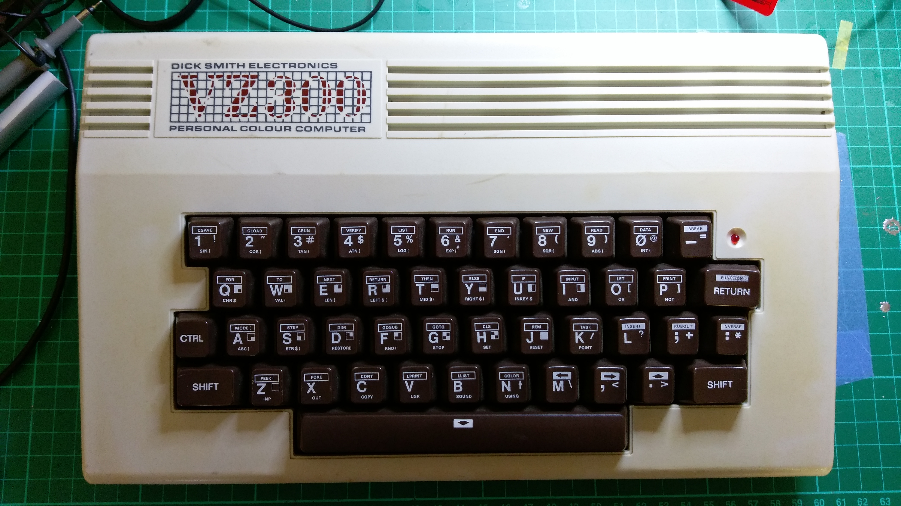

VZ300 Restoration
=================

My friend Brian had two VZ200's and two VZ300's in his shed.  One each of the
VZ200's and VZ300's were working, so he kept them and gave me the two
non-working ones.

* [VZ300 Schematic](schematics/VZ300/PDF/VZ300.pdf)

## Unit 1

The first unit was a plain VZ300 with a mechanical keyboard:

The RF shield had been removed, but the PCB appeared to be in good condition:

However, when I powered it on the screen showed garbage.  The data and
address lines looked mostly OK, although one of the data lines was a
little wonky.  I suspect that the ROM or a DRAM chip on that data line may
have a problem, but haven't investigated any further.

## Unit 2

The second VZ300 was actually in a VZ200 case!

The RF shield was still fitted, but the keyboard ribbon cable and
piezospeaker wires had been cut:

Why was it in a VZ200 case?  Well, the original owner prior to Brian had
swapped the VZ200 and VZ300 motherboards for two of his units.  This gave
him a VZ200 with a mechanical keyboard!  Brian still has the "VZ200 in a
VZ300 case".  The Unit 2 VZ300 is the left-over PCB that was never
reconnected in its new case.

The VZ200 case also has some interesting modifications:

The original owner had added extra function keys, a caps lock key, and a reset
button to the keyboard matrix.  These holes are where the extra keys were
located.  The "VZ200 in a VZ300 case" has similar modifications
(this picture is a screenshot from a blurry video Brian sent me):

I connected power and composite video to unit 2 and got a BASIC prompt.
So other than the missing keyboard, it appeared to be working fine.

## Making a new VZ300!

In summary,

* Unit 1 had a non-working motherboard and a working mechanical keyboard.
* Unit 2 had a working motherboard and no keyboard.

So I swapped the two motherboards, washed the case, and I now have a
fully working VZ300 in an original case!

At some point in the future I will get back to the non-working VZ300
motherboard and try to figure out what is wrong with it.

