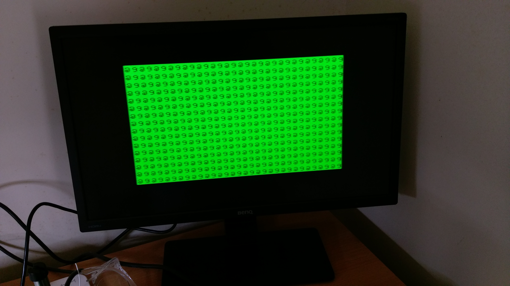
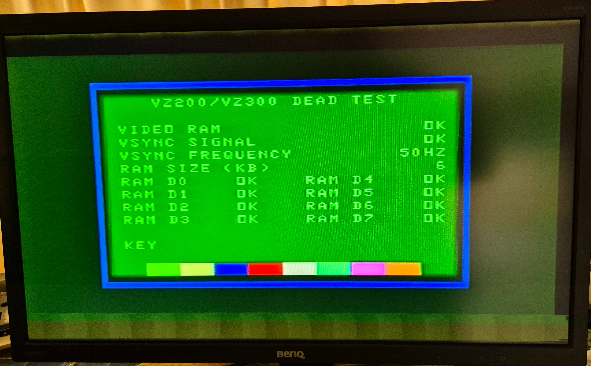

VZ300 Restoration
=================

My friend Brian had two VZ200's and two VZ300's in his shed.  One each of the
VZ200's and VZ300's were working, so he kept them and gave me the two
non-working ones.

* [VZ300 Schematic](schematics/VZ300/PDF/VZ300.pdf)

## Unit 1

The first unit was a plain VZ300 with a mechanical keyboard:

The RF shield had been removed, but the PCB appeared to be in good condition:

However, when I powered it on the screen showed garbage.  The data and
address lines looked OK, although the ROM chip select looked a little wonky.
I put unit 1 aside - see below for when I revisited Unit 1 later.

## Unit 2

The "VZ200" that Brian gave me was actually a VZ300 in a VZ200 case!

The RF shield was still fitted, but the keyboard ribbon cable and
piezospeaker wires had been cut:

Why was it in a VZ200 case?  Well, the original owner prior to Brian had
swapped the VZ200 and VZ300 motherboards for two of his units.  This gave
him a VZ200 with a mechanical keyboard!  Brian still has the "VZ200 in a
VZ300 case".  The Unit 2 VZ300 is the left-over PCB that was never
reconnected in its new case.

The VZ200 case also has some interesting modifications:

The original owner had added extra function keys, a caps lock key, and a reset
button to the keyboard matrix.  These holes are where the extra keys were
located.  The "VZ200 in a VZ300 case" has similar modifications
(this picture is a screenshot from a blurry video Brian sent me):

I connected power and composite video to unit 2 and got a BASIC prompt.
So other than the missing keyboard, it appeared to be working fine.

## Making a new VZ300!

In summary,

* Unit 1 had a non-working motherboard and a working mechanical keyboard.
* Unit 2 had a working motherboard and a disconnected keyboard.

So I swapped the two motherboards, washed the case, and I now have a
fully working VZ300 in an original case!

## Back to Unit 1

After some months I got back to the non-working Unit 1 motherboard to
try to figure out what was wrong with it.  The first thing I did was
replace the cut-off keyboard ribbon cable with a pin edge connector,
just as I had done on my other VZ200 and VZ300 boards:

### Screen test

Turning the unit on, garbage is displayed on the screen.  The type of
garbage can vary on each boot-up, but this is typical:

The ghosted vertical bars off to the right are "normal" - it also happens
with the other working unit and my RetroTink.  Ignoring that, there are a few
things that we can tell from this screenshot:

* The MC6847 Video Display Generator (U15) is working and displaying
characters from its internal character ROM.
* The 6116 video RAM chip (U16) is also working and retaining the
initial random startup state.
* The CPU has not properly initialized the screen, so the ROM code is
probably not running.  There is no static that may indicate that the
CPU is trying to write to the video RAM.
* The video clock generated by Gate Array 1 (U13) is fine.
* Gate Array 2 (U14) is not interfering with the MC6847's access to
video RAM.
* The CPU and PAL clocks generated by Gate Array 3 (U10) are fine.
* The CSS pin on the MC6847 has not been initialized so the text is using
an orange background instead of the more usual green.  On other
boot-ups, the background is sometimes green.

So it isn't all bad.

### Replacing the ROM

The screenshot is similar-looking to the initial state of my VZ200 before I
restored it:

In the case of the VZ200, the mask ROM's were bad.  Replacing them made the
VZ200 come good.  So the first order of business was to replace the
16K ROM chip (U12) on the VZ300 with a modern 32K AT28C256 EEPROM that
I had lying around.  I duplicated the 16K image into both halves of the
32K AT28C256.  Except for an extra address line, the pinout of the
AT28C256 is identical to the original ROM.

This time I used a desoldering pump that I purchased from Amazon.
I didn't tear up any tracks this time, as when I replaced the VZ200's ROM's.

Unfortunately, this didn't make any difference.  The screen was still
corrupted.  The original ROM also tested good in my
<a href="https://store.backbit.io/product/chip-tester/">BackBit Chip Tester Pro</a> and I confirmed that it contained the V2.0 version of the ROM's.
On the plus side, the ROM has now been updated to V2.1!

### ROM Chip Select

I probed around the ROM (U12) with an oscilloscope.  The chip select line
(pin 20) looked a little weird:

The baseline was shifted up by about 0.6V and the shape was definietly
not square.  It looked some kind of RC response.  Looking at the schematic,
there is a diode-AND arrangement that connects pin 20 to the R0 and R1
lines on Gate Array 1 (U13):

R0 is pulled low for addresses $0000 to $1FFF and R1 is pulled low for
addresses $2000 to $3FFF.  In the original VZ200 design, there were two
8K ROM's in these ranges.  In the VZ300, there is a single 16K ROM.
Hence the diode AND arrangement to combine the two chip selects into one.
The diode voltage drops would account for the 0.6V shift in the baseline.

When I probed the cathode sides of D7 and D8, I got signals that looked
like this:

That looks almost perfect (the overshoot is probably due to the long ground
lead on my oscilloscope probe).  The widths of the square pulses in this
trace are very similar to the widths of the triangular pulses in the
previous trace.

I replaced R32, D7, and D8, but it didn't make any difference.  I measured
the capacitance on the chip select line at about 2nF.  There was a
capacitor near the ROM, so I temporarily removed it:

That did not help - the shape of the chip select waveform was the same.
And now there was video flicker that wasn't there before.  Whatever that
capacitor is used for, it isn't related to the chip select.

I then disassembled Unit 2, which was working, and checked the chip
select line on that.  It had the same weird triangular shape as Unit 1.
So maybe the chip select was a red herring after all ...

### Checking the CPU pins

I probed all of the address, data, and control lines on the Z80 CPU and
they all looked reasonable.

### Checking the dynamic RAM

I probed the eight 4816AP-11 DRAM chips.  The CAS line was stuck high and all
address lines were stuck low.  This was suggesting that Gate Array 3 (U10)
was not decoding the dynamic RAM addresses correctly.  Without working
DRAM, the system would definitely have trouble starting.

As a check, I pulled one of the HM4816AP-11 DRAM chips and tested it.
It was fine.

### Dead Test ROM

Pulling and replacing chips wasn't getting me anywhere.  So I tried a
different approach.  I wrote a small assembly program to initialise video
text mode and fill the screen with a blue checkboard.  I replaced the
BASIC ROM with the program in EEPROM.

I already knew that video RAM and the MC6847 Video Display Generator (VDG)
were working.  If a blue checkboard appeared, then the ROM was working too.
This is what I got:

Yay!  Now we are getting somewhere.  The system is alive enough to
run code from ROM and display video.  The weird looking chip select is fine.

So I wrote a comprehensive [VZ200/VZ300 Dead Test ROM](src/deadtest/README.md)
to test video, I/O, RAM, VSYNC timing, everything.  On my VZ200, the result
looks like this (all good):

On the VZ300, the result was this:

Everything is fine except the DRAM.  But I know that the DRAM chip that I
pulled (D6) was working fine.  So it looks like Gate Array 3 (U10) is dead.
That's annoying.

### What is working so far?

So now we know that the CPU, MC6847, ROM, Video RAM, Gate Array 1, and
Gate Array 2 are all working.  The DRAM chips are probably good, but
Gate Array 3 is definitely not.

Gate Array 3 is partially working.  It is responsible for dividing the
17.734MHz clock crystal down to 4.434MHz for the PAL encoder (divide by 4),
and 3.547MHz for the CPU (divide by 5).  These clocks are working fine.
It is just the DRAM interface inside Gate Array 3 that is not working.

### Replacing Gate Array 3

TBD
