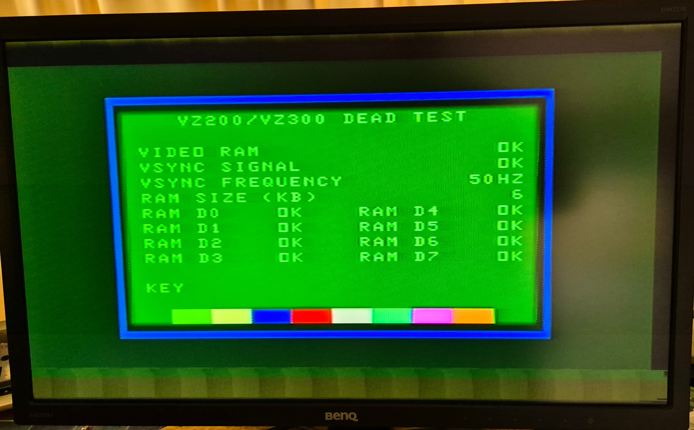

VZ200/VZ300 Dead Test
=====================

This directory contains a "Dead Test" ROM image for VZ200 and VZ300
computers.  It assumes that ROM address decoding, the MC6847 Video
Display Generator (VDG), and the 2K of static video RAM are basically
working, but everything else will be tested by the ROM as it executes.

To use it with VZ200, replace U9 (ROM0) with the 8K dead test image.
To use it with VZ300, replace U12 with the 16K dead test image.
Obviously, you will need to desolder the original ROM's and fit a
socket for the replacement EEPROM.

8K, 16K, and 32K versions of the image are provided, depending upon what
size of EEPROM you are using.  The 16K and 32K versions duplicate the
8K image multiple times so that the test can run from any 8K-aligned address.

Here is what a successful result looks like on a VZ200:

## Building

The assembly code in `deadtest.asm` is designed to be assembled by
[pasmo](https://pasmo.speccy.org/) under a Linux-like system.  It is assumed
that pasmo has been installed and is somewhere on your PATH.  Then type:

    make

This will build `vzdt8k.rom`, `vzdt16k.rom`, and `vzdt32k.rom`.

## Tests

### Video Display

Display of video is tested implicitly.  If you see readable text on the
screen, then the MC6847 Video Display Generator (VDG) and the video
output circuitry are working.  Also, the Z80 CPU is successfully running
code out of ROM.

### Beep

The dead test will beep the speaker at startup.  If you don't see
readable text on-screen but hear the beep, then the Z80 CPU is
successfully running code out of ROM but there may be something
wrong with the video system.

If you see readable text on-screen but don't hear a beep, then either the
speaker is not connected or there is something wrong with I/O output:
U1 (74LS174), U2 (74LS32), and U3 (74LS139) on the VZ200.  On the VZ300,
I/O output is handled by a combination of U13 (Gate Array 1) and
U14 (Gate Array 2) - mostly U14.

### Video RAM

Fills the 2K of video memory at $7000 with a test pattern and reads it back.
Test succeeds if the contents are the same.  This tests U7 on the VZ200 or
U16 on the VZ300.

This will verify that address decoding of the range $7000 to $77FF is working,
which is a combination of U2 (74LS32), U3 (74LS139), and U14 (74LS245)
on the VZ200.

On the VZ300, a combination of U13 (Gate Array 1) and U14 (Gate Array 2)
are involved in video RAM access.  If you see something on-screen and
you hear a beep, then these chips are probably OK.

If the video RAM test fails, then all other tests will be skipped.
The other tests use the high part of video RAM for the system stack and
scratch memory.  Working video RAM is essential.

### VSYNC

The vertical sync signal from the MC6847 is delivered to the CPU on the
"INT" interrupt pin, and also via the I/O input interface.  Under normal
operation a 50Hz or 60Hz active-low pulse is expected on this signal.

The first part of this test polls the I/O input to look for regular pulses.
If no pulses are seen, then "BAD" is reported and the second part of the
test is skipped.

If the first part succeeds, then interrupts will be enabled and the test
repeated.  The number of interrupts per second is measured and the test will
report "50HZ", "60HZ", or "??HZ" as appropriate.

The interrupt test is the first test that needs working RAM for the
stack and the interrupt counter.  If video RAM is not actually working
despite the previous tests, then the dead test may get stuck here.

### Main Program RAM

This test determines how much main program RAM is present on the system,
and tries to figure out which data bits are not working correctly.

On the VZ300 which uses dynamic RAM, this can help identify dead DRAM chips.
It is also possible that U10 (Gate Array 3) is dead, as it is responsible
for DRAM access.  If all data bits report as bad, then check the
address and CAS lines with an oscilloscope to see if they are stuck.
If they are, then the gate array is probably the culprit.

On the VZ200, things are simpler.  Pull the static RAM chips and test them.
The 74LS138 address decoder may also have issues.

### Keyboard

After all previous tests, the dead test will go into an infinite loop
waiting for keys to be pressed on the keyboard.  The keys that are
pressed will be displayed on-screen; e.g. `SHIFT+B`.

This tests the keyboard and I/O input.  On the VZ200, U2 (74LS32),
U3 (74LS139), and U12 (74LS244) are involved in keyboard input.  On the VZ300,
a combination of U13 (Gate Array 1) and U14 (Gate Array 2) are involved in
keyboard input - mostly U14.

If some of the keys are working, then check which ones fail against the
key matrix:

    Address   | D5  D4  D3  D2  D1  D0
    ----------+-----------------------
    $68FE  A0 |  R   Q   E       W   T
    $68FD  A1 |  F   A   D CTRL  S   G
    $68FB  A2 |  V   Z   C SHFT  X   B
    $68F7  A3 |  4   1   3       2   5
    $68EF  A4 |  M  SPC  ,       .   N
    $68DF  A5 |  7   0   8   -   9   6
    $68BF  A6 |  U   P   I RETN  O   Y
    $687F  A7 |  J   ;   K   :   L   H

If all of the keys in a row are dead, then that address line may have a
problem.  If all of the keys in a column are dead, then that data line
may have a problem.  Check the tracks around the keyboard connector on
the PCB and the keyboard ribbon cable for breaks.

Press CTRL+BREAK to restart the test sequence from the beginning.

## Cartridge Version?

To run the dead test it is necessary to desolder a ROM chip from the
motherboard and replace it (after adding a socket of course).  In theory,
the dead test could be made into a cartridge that plugs into the
expansion port instead.  No de-soldering required.

In the VZ200/VZ300 design, the cartridge ROM code is only executed after a
lot of regular ROM initialisation and RAM access have already occurred.
If these are bad, then the cartridge ROM code will never be executed.
This defeats the purpose of the dead test.

This is unlike the Commodore 64 and other platforms where inserting a
cartridge physically disables the main ROM.  On those platforms, the
dead test can be non-invasive.

## Contact

For more information on this project, to report bugs, or to suggest
improvements, please contact the author Rhys Weatherley via
[email](mailto:rhys.weatherley@gmail.com).
